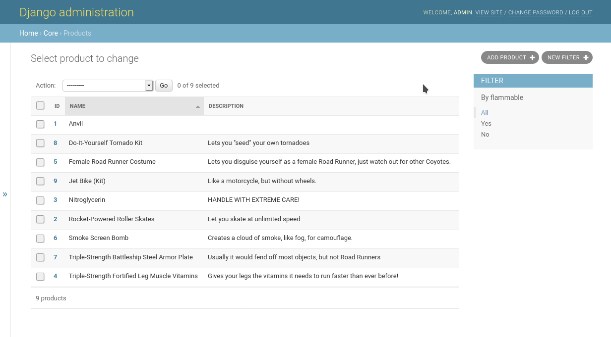

# django-admin-model-filters

A Django extension that allows filtering models in the changelist view of
the admin interface using the model's individual fields.



## Features

1. Filter models by specific fields and types, instead of a generic search that
   converts everything to `UPPER` strings. This allows the native data types
   to be used, and any indexes you have to be taken advantage of.
1. Supports object level permissions with `django-guardian`. Model filters can
   be shared with users and/or groups through the admin interface. If 
   `django-guardian` is not setup, regular Django class level permissions are
   used, unless the `MODEL_FILTERS_*_OWNER_ONLY` settings are `True`.
1. Supports `grappelli` admin skin.

## Installation

Install the extension into your environment:

```shell
pip install django-admin-model-filters
```

Add the extension to the list of `INSTALLED_APPS`:

```python
INSTALLED_APPS = [
    ...
    "model_filters",
    ...
]
```

Run the migrations for the extension:

```shell
./manage.py migrate model_filters
```

## Usage

Add the `ModelFilterMixin` to any existing `ModelAdmin` classes in
your project that you wish to filter.

Define a list or tuple of fields, `model_filters`, that you want to filter the
model using. The values should be of one of the following types:

1. A field name. Field names can also span relations using the `__` lookup. By
   default, the field's `verbose_name` is used for display purposes.
1. A tuple, where the first element is a field name, and the second element is
   a custom verbose name to display for the field.

For example:

```python
from django.contrib import admin
from model_filters.admin.mixins import ModelFilterMixin

@admin.register(Widget)
class WidgetModelAdmin(ModelFilterMixin, admin.ModelAdmin):
    ...
    model_filters = [
        ("name", "Widget Name"),
        "part_number",
        ("component__name", "Component Name"),
        "serial_number",
    ]
    ...
```

## Permissions

Uses Django's built-in permission framework, and supports `django-guardian` for
object-level permissions.

By default, model filters can only be used by the user that created them (their
`owner`). Use the `MODEL_FILTERS_*_OWNER_ONLY` settings to allow sharing them
with other users and groups.

Note that you can of course override any of the `has_*_permission` methods
by creating your own `ModelAdmin` that extends and replaces the existing
`ModelFilterAdmin`.

## Settings

The following settings can be configured in your `settings.py`:

### `MODEL_FILTERS_VIEW_OWNER_ONLY`
Default: `True`

If `True`, only the `owner` of a model filter can view it, regardless of any
permissions that have been set. If `False`, any user or group with the `view`
permission can view the model filter. Superusers have full access.

### `MODEL_FILTERS_CHANGE_OWNER_ONLY` 
Default: `True`

If `True`, only the `owner` of a model filter can change it, regardless of any
permissions that have been set. If `False`, any user or group with the `change`
permission can change the model filter. Superusers have full access.

### `MODEL_FILTERS_DELETE_OWNER_ONLY`
Default: `True`

If `True`, only the `owner` of a model filter can delete it, regardless of any
permissions that have been set. If `False`, any user or group with the `delete`
permission can delete the model filter. Superusers have full access.

### `MODEL_FILTERS_ORDER_BY`
Default: `[Lower("name").asc(nulls_first=True), "-created"]`

A field, or list of fields, to order the model filters by in the model admin
list filter menu. The contents of this setting will be passed directly to the
`order_by` method of the queryset.

### `MODEL_FILTERS_USE_GUARDIAN`
Default: `True`

If `True`, and `guardian` is found in your `INSTALLED_APPS`, then object level
permissions will be used via Django Guardian. Note that object level permissions
are only available if `MODEL_FILTERS_*_OWNER_ONLY` are `False`. 

## Developers

Create a Python 3.7 virtualenv and install the developer requirements into it:

```shell
pip install -r requirements/developer.txt
```

This is a `tox` based project. Run `tox` to ensure you are in a good state.
You may want to edit `tox.ini` to exclude specific Python or Django versions
that your environment does not support, or just to simplify the build during
development.

Create your local developer settings:

```shell
cp acme/settings/developer.py acme/settings/local_settings.py
```

Use this settings file to override any settings during development. This file
is ignored by git and the packager.

### Development and Testing Project

The core extension is in the `model_filters` package. 

The `acme` package is a project used for development and testing purposes.
Use the `./manage.py` file at the project root like you would any other Django
project, including `./manage.py runserver` to explore the `acme` test project.

Some sample data is provided in `acme/fixtures/data.json`. Load it into your
database with `./manage.py loaddata acme/fixtures/data.json`.

### Code Style

This project uses `black` and `isort` to maintain consistency and uniformity.

Run `tox -e codestyle` to check your code style. Run `black .` and `isort .`
to format the entire project, or configure your IDE to run them after saving.

### Code Analysis

This project uses `flake8` and `pylint` to find bugs and maintain quality.

Run `tox -e flake8` and `tox -e pylint` to analyse your code style.

### Testing

This project uses `pytest` and `coverage`.

Look at `pytest.ini` to see the available pytest markers and overall pytest
configuration.

Check your coverage after running tests here: `build/reports/htmlcov/index.html`

#### Basics

Run all tests with Python 3.7 and Django 3.2:

```shell
tox -e py37-django32
```

Run all end-to-end tests:

```shell
tox -e py37-django32 -- -m e2e
```

Run everything except the end-to-end tests:

```shell
tox -e py37-django32 -- -m "not e2e"
```

Run all tests in a specific test class:

```shell
tox -e py37-django32 -- acme/tests/e2e/modelfilter_create_tests.py::Tests
```

Run a specific test in a test class:

```shell
tox -e py37-django32 -- model_filters/utilities_tests.py::Tests::test_user_has_permission
```
